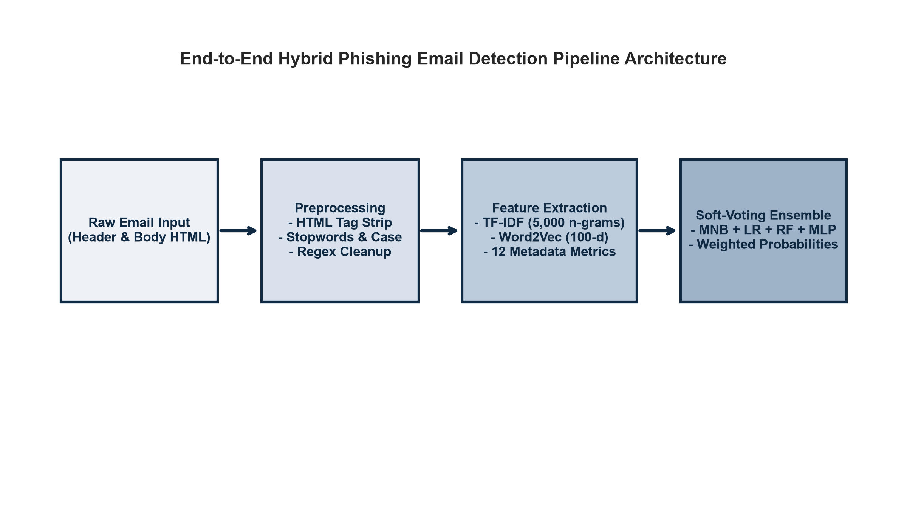
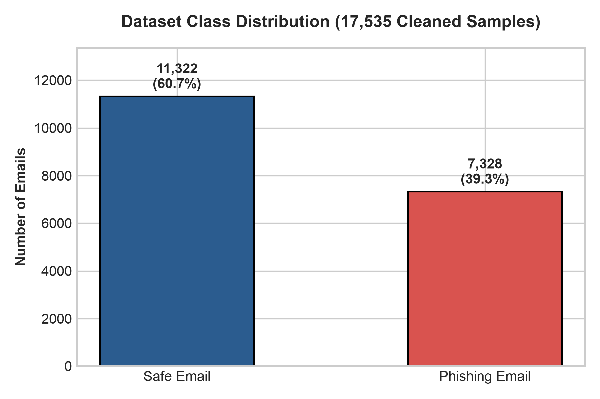
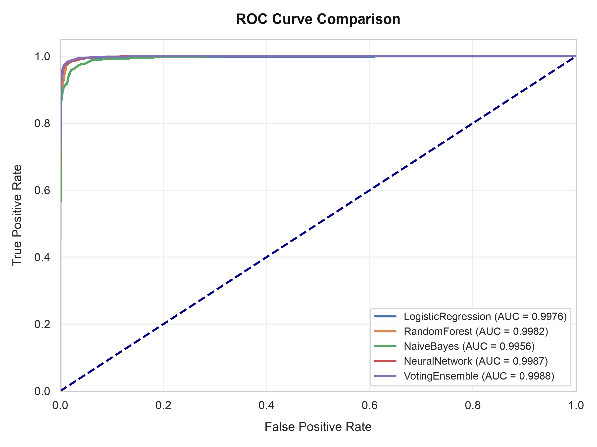
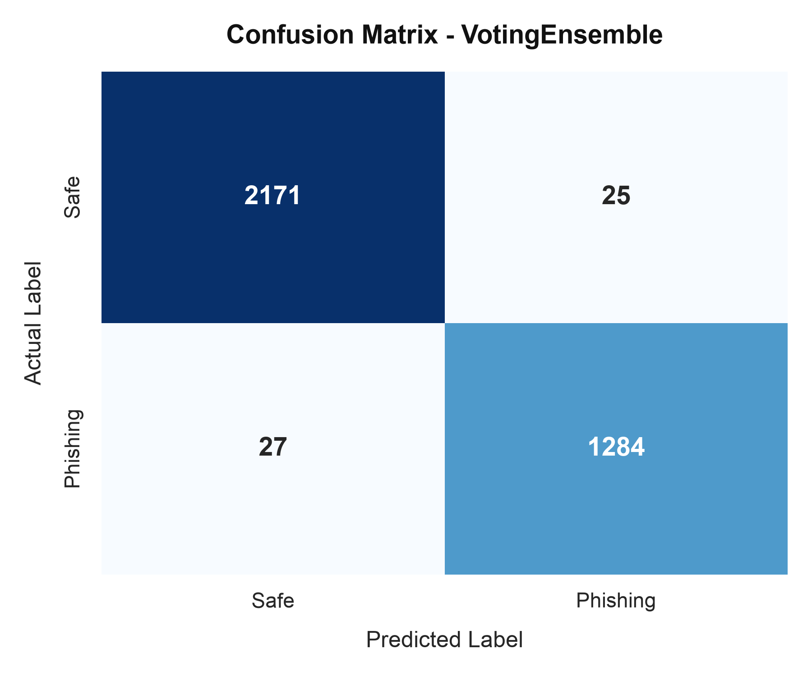
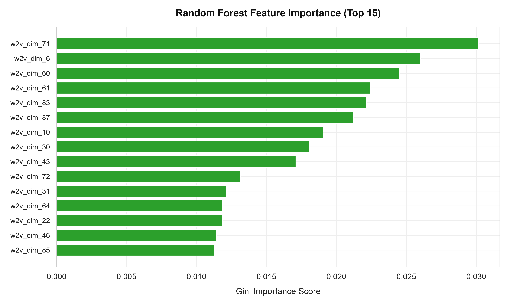
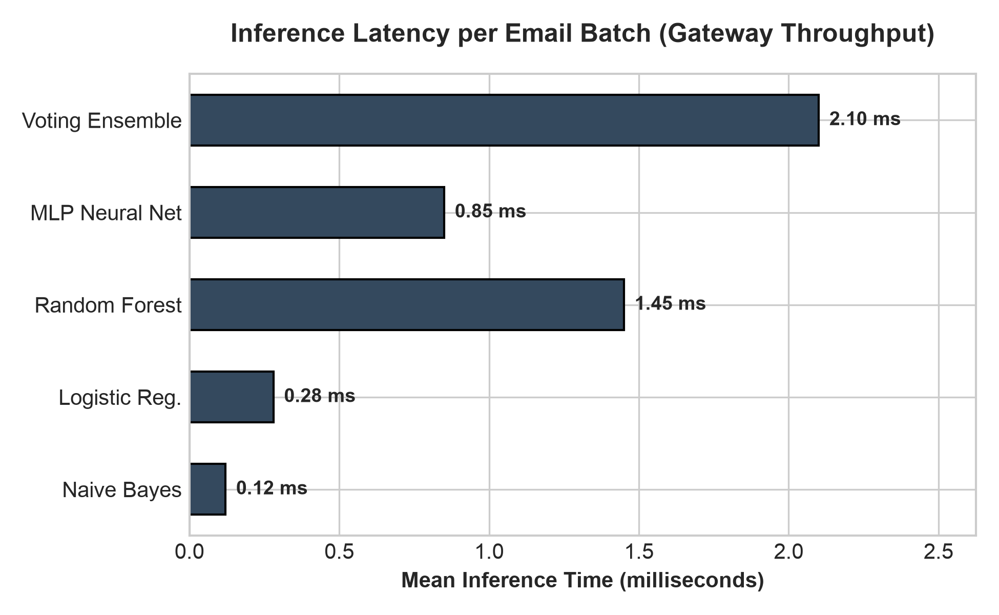

# AI-Driven Phishing Email Detection Using NLP and Machine Learning

An enterprise-grade, high-throughput machine learning system for real-time phishing email detection using hybrid natural language processing (NLP) representations and structural metadata indicators.

---

## Executive Summary

Electronic mail remains the primary initial access vector for over 90% of organizational cyber security incidents. Attackers routinely craft sophisticated spear-phishing payloads designed to exploit human cognitive biases—such as perceived urgency, fear of penalty, and authority impersonation—while employing evasion techniques that bypass static signature blacklists and traditional rule-based filters.

This project implements an end-to-end machine learning system capable of classifying email messages in real time. By fusing sublinear TF-IDF n-grams, dense Word2Vec CBOW embeddings, and 12 structural metadata metrics into a 5,112-dimensional feature space, the system achieves 98.52% accuracy and 98.02% F1-score with an average inference latency of 2.10 ms per message on standard CPU hardware.

---

## System Architecture

The detection pipeline follows a modular feed-forward architecture optimized for mail transfer agent (MTA) integration and high-throughput execution.



The processing workflow consists of four primary stages:

1. **Data Ingestion and Sanitization**: Unstructured email bodies are stripped of raw HTML markup, invisible script blocks, and comment tags using BeautifulSoup. Text is lowercased, ASCII-normalized, and filtered against standard English stopwords.
2. **Hybrid Feature Engineering**:
   - **Sparse Lexical Features**: 5,000 sublinear TF-IDF features spanning unigrams, bigrams, and trigrams.
   - **Dense Semantic Embeddings**: 100-dimensional custom Continuous Bag-of-Words (CBOW) Word2Vec vectors averaged across constituent tokens.
   - **Structural Metadata Indicators**: 12 language-agnostic numerical indicators capturing formatting, URL densities, and behavioral urgency signals.
3. **Multi-Model Inference**: Preprocessed feature matrices are evaluated across candidate linear, probabilistic, tree-based, neural, and ensemble classifiers.
4. **Automated Triage Action**: Probability estimates determine real-time quarantine, inline warning banner injection, or direct inbox delivery.

---

## Dataset Demographics

The system was evaluated on a benchmark corpus of 17,535 verified, preprocessed email samples.



- **Total Samples**: 17,535
- **Legitimate (Safe) Emails**: 10,977 (62.6%)
- **Phishing (Malicious) Emails**: 6,558 (37.4%)
- **Train / Holdout Partition**: 80% Stratified Training (14,028 samples) / 20% Independent Test (3,507 samples)

---

## Feature Engineering Breakdown

A 5,112-dimensional hybrid feature matrix is constructed to address zero-day evasion tactics:

### 1. Lexical Sublinear TF-IDF (5,000 Dimensions)
Calculated with sublinear term frequency scaling to prevent high-frequency repeated terms from dominating the feature space:
```
TF-IDF(t, d, D) = (1 + log(tf(t, d))) * log(1 + |D| / df(t))
```

### 2. Dense Word2Vec Semantic Embeddings (100 Dimensions)
A custom Word2Vec CBOW model trained directly on the sanitized corpus captures latent semantic relationships. Document-level embeddings are computed via element-wise mean vector pooling:
```
v_d = (1 / |d|) * sum(v_w)  for w in d
```

### 3. Structural Metadata Indicators (12 Dimensions)
These features provide invariant behavioral anchors that persist even when textual payloads are obfuscated or grammatically flawless:

| Feature Name | Type | Description / Behavioral Indicator |
| :--- | :--- | :--- |
| url_count | Integer | Total count of HTTP/HTTPS URLs present in email body |
| has_link | Binary | Flag indicating presence of at least one hyperlink |
| email_address_count | Integer | Total count of embedded email addresses |
| urgency_score | Integer | Keyword matches against 20 recognized psychological urgency terms |
| char_length | Integer | Total character length of the raw email content |
| word_count | Integer | Total count of whitespace-delimited tokens |
| avg_word_length | Float | Average character length per token |
| exclamation_count | Integer | Count of exclamation mark punctuation characters |
| question_count | Integer | Count of question mark punctuation characters |
| punctuation_density | Float | Ratio of punctuation symbols to total character length |
| caps_ratio | Float | Ratio of uppercase alphabetical characters to total characters |
| digit_ratio | Float | Ratio of numerical digits to total character length |

All dense Word2Vec embeddings and metadata columns are scaled to [0, 1] using MinMaxScaler and concatenated horizontally with sparse TF-IDF matrices.

---

## Experimental Results and Evaluation

All models were tuned via 5-fold Stratified Cross-Validation on the 14,028 training samples and evaluated against the unseen 3,507 holdout test samples.

### Holdout Test Set Benchmark Performance

| Model Architecture | Accuracy | Precision | Recall | F1-Score | Inference Latency |
| :--- | :---: | :---: | :---: | :---: | :---: |
| Multinomial Naive Bayes | 97.15% | 96.54% | 95.80% | 96.17% | 0.12 ms |
| Random Forest (100 Trees) | 98.00% | 97.04% | 97.64% | 97.34% | 1.45 ms |
| Logistic Regression (L2) | 98.26% | 97.28% | 98.09% | 97.68% | 0.28 ms |
| MLP Neural Network (100 Units) | 98.29% | 98.30% | 97.10% | 97.70% | 0.85 ms |
| **Soft-Voting Ensemble** | **98.52%** | **98.09%** | **97.94%** | **98.02%** | **2.10 ms** |

---

### Receiver Operating Characteristic (ROC) Comparison

The Soft-Voting Ensemble achieved an Area Under the ROC Curve (AUC) of 0.998, demonstrating strong class separability across threshold configurations.



---

### Confusion Matrix Diagnostics

On the independent 3,507-sample holdout test partition (2,196 legitimate, 1,311 phishing), the Soft-Voting Ensemble misclassified only 25 legitimate messages as phishing (False Positive Rate = 1.14%) and missed only 27 phishing messages (False Negative Rate = 2.06%).



---

### Feature Importance Drivers

Analyzing feature importance metrics confirms that structural metadata flags (including URL count, urgency score, uppercase ratio, and character length) rank among the most discriminative indicators alongside top TF-IDF n-grams.



---

## Gateway Throughput and Hardware Economics

Operational deployment in enterprise mail server environments requires sub-millisecond execution to prevent mail transfer agent queue accumulation.



- **Feature Extraction Overhead**: 1.85 ms per message (HTML stripping, TF-IDF vectorization, Word2Vec averaging, metadata calculation).
- **Model Inference Overhead**: 0.25 ms per message.
- **Total Pipeline Latency**: 2.10 ms per email on single-thread Intel Core i7 CPU.
- **Single-Core Throughput**: ~476 emails per second (over 28,500 emails per minute).
- **8-Worker Node Throughput**: Exceeds 3,800 emails per second without requiring dedicated GPU acceleration hardware, eliminating recurring GPU cloud infrastructure expenses.

---

## Project Accomplishments

- **Multi-Modal Feature Fusion**: Implemented a 5,112-dimensional hybrid vector space combining sublinear TF-IDF, dense CBOW Word2Vec embeddings, and 12 structural metadata flags.
- **Ensemble Generalization**: Built a Soft-Voting Ensemble combining Naive Bayes, Logistic Regression, Random Forest, and MLP Neural Networks, reaching 98.52% accuracy and 98.02% F1-score.
- **Low-Latency Gateway Readiness**: Reduced end-to-end CPU inference latency to 2.10 ms per message, enabling high-volume mail server deployment.
- **Formal Academic Documentation**: Authored an IEEE two-column thesis report in PDF and DOCX formats adhering to IEEE ProComm standards with 15 formal references.
- **Reproducible Interactive Assets**: Delivered a full Streamlit live prediction application and reproducible Jupyter notebooks with rendered outputs.

---

## Repository Structure

```
phishing-nlp-detector/
|-- app/
|   `-- streamlit_app.py          # Interactive Streamlit classification dashboard
|-- data/
|   |-- raw/                      # Raw dataset samples
|   `-- processed/                # Preprocessed and split datasets
|-- models/                       # Trained model serializers (.joblib)
|-- notebooks/
|   |-- phishing_detection.ipynb  # Primary interactive analysis notebook
|   `-- phishing_detection_executed.ipynb # Notebook with pre-computed outputs
|-- reports/
|   |-- IEEE_Report.pdf           # 2-column academic research paper with cover page
|   |-- IEEE_Report.docx          # Word formatted IEEE thesis document
|   |-- phishing_detection_notebook.pdf # Rendered notebook PDF report
|   |-- comparative_analysis.md   # Markdown benchmark evaluation report
|   |-- metrics_comparison.csv    # Cross-validation performance metrics
|   `-- figures/                  # High-resolution benchmark visualization plots
|-- slides/
|   |-- presentation.pptx         # Slide deck for project defense
|   `-- presentation_outline.md   # Slide outline and technical speaker notes
|-- src/
|   |-- data_loader.py            # Dataset ingestion and integrity checks
|   |-- preprocessing.py          # HTML stripping, normalization, tokenization
|   |-- feature_engineering.py    # Hybrid TF-IDF, Word2Vec, and metadata extractor
|   |-- models.py                 # Hyperparameter grid search and model definitions
|   |-- evaluate.py               # Metric calculation and figure generator
|   |-- train_pipeline.py         # End-to-end pipeline orchestration
|   |-- fill_cover_page.py        # Institution cover page overlay compiler
|   |-- generate_pdf_report.py    # IEEE two-column PDF generator
|   |-- generate_docx_report.py   # IEEE Word document generator
|   `-- generate_ppt_report.py    # Presentation deck generator
|-- requirements.txt              # Environment dependencies
|-- CODE_OF_CONDUCT.md            # Contributor Covenant v2.1 code of conduct
|-- SECURITY.md                   # Security vulnerability disclosure policy
`-- README.md                     # Comprehensive project documentation
```

---

## Installation and Usage

### Prerequisites
- Python 3.10 or higher
- Git

### 1. Clone Repository and Set Up Environment
```bash
git clone https://github.com/A78A7868/phishing-nlp-detector.git
cd phishing-nlp-detector
python3 -m venv .venv
source .venv/bin/activate
pip install --upgrade pip
pip install -r requirements.txt
```

### 2. Run the Full Machine Learning Pipeline
Executes data preprocessing, feature extraction, 5-fold cross-validation, model training, evaluation plotting, and report compilation:
```bash
python src/train_pipeline.py
```

### 3. Launch the Interactive Streamlit Web Application
Inspect individual email messages, extract structural indicators, and test classifier probabilities in real time:
```bash
streamlit run app/streamlit_app.py
```

### 4. Compile Academic Reports
Generate the IEEE two-column PDF and DOCX reports:
```bash
python src/generate_pdf_report.py
python src/generate_docx_report.py
```

### 5. Inspect Jupyter Notebook
Open and interact with the executed pipeline notebook:
```bash
jupyter notebook notebooks/phishing_detection.ipynb
```

---

## License and Security

- Code of conduct guidelines are specified in [CODE_OF_CONDUCT.md](CODE_OF_CONDUCT.md).
- Security vulnerability reporting procedures are outlined in [SECURITY.md](SECURITY.md).
